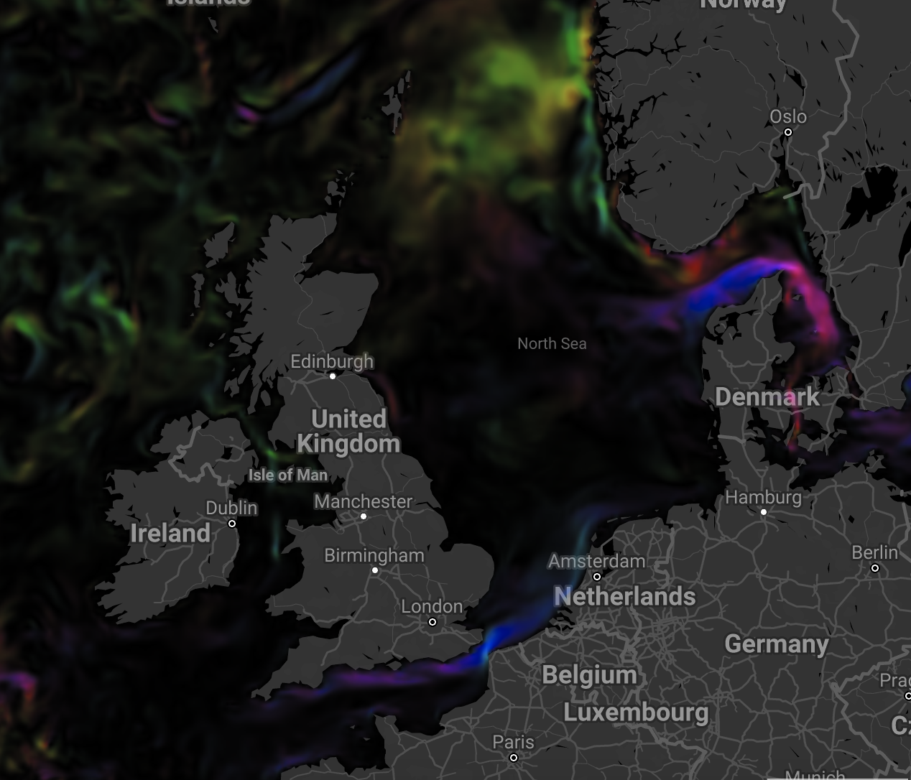
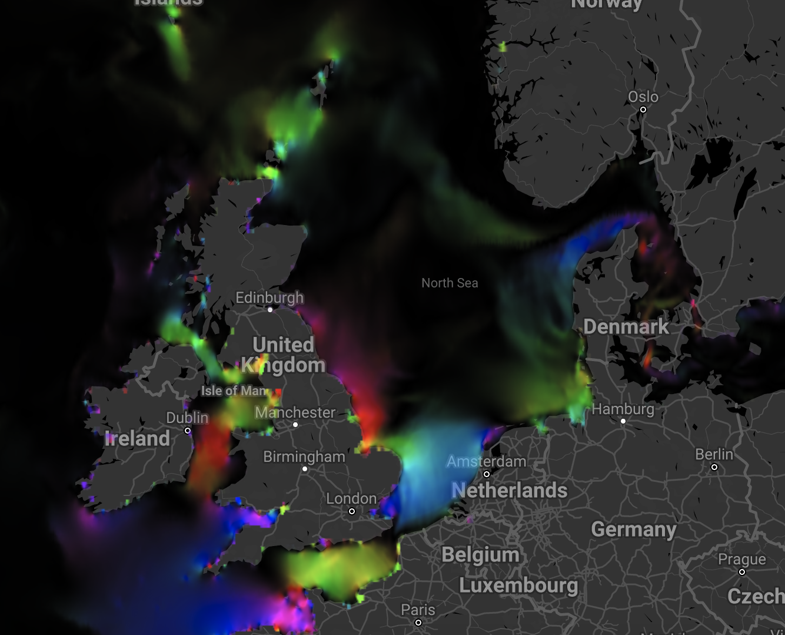

# Currents for the Digital Twin North Sea


## Goal

This dataset and the corresponding application programming interface  (API)
provides current fields for the [Digital Twin North Sea](https://www.digishape.nl/nieuws/noordzeedagen-oktober-2021-update-digitwin-noordzee).

Different purposes require different currents. Common usages include:

- Optimizing shipping routes, finding the shortest path. This requires realtime currents on the surface.
- Ecological model, transport of plankton. Requires currents, typically in the upper regions, but sometimes near the bottom, averaged over a period.
- Search and rescue, finding people lost at sea. This requires currents near the surface, unless people are deceased then they can float in different locations in the water column, a day ahead.
- Drifter studies, tracking transport of particles, such as plastics. Typically requires surface currents over the period of several days, weeks or months.

Here we focus on the Ecological use. The current fields are intended
for use in  the [ecopath/ecosim](https://ecopath.org/) simulations in the [Marine Spatial Planning](https://www.buas.nl/en/research/domains/games/msp-challenge) Tool component.


## Features
We provide a number of features in our currents api.
- Density currents on top layer of the ocean based on the [HYCOM](https://www.hycom.org/) model
- Tidal and wind driven currents based on an archive of the [GLOSSIS](https://www.deltares.nl/en/projects/global-storm-surge-information-system-glossis/) operational system
- Selection by bounding box (default North Sea)
- Custom scale (default 10km)



Example currents from the HYCOM Ocean model. Note the density currents near the Norwegian coast. Hue represent direction. Intensity represents velocity (0-1m/s).


Example currents from the GLOSSIS Coastal model. Note the tidal currents that circle around the UK. Hue represent direction. Intensity represents velocity (0-1m/s).


## Methods
To determine the current fields we use the following workflow:
- define the region of interest (North Sea)
- define the scale of interest (10km)
- define the coordinate system (EPSG:3505)
- define the timespan of interest (2020-07-01 -- 2021-07-01)
- determine the months in the timespan of interest
- for each month:
- compute monthly mean current velocity u, v field
- for HYCOM choose the top layer (level 0)
- rescale the current field to the region of interest at the requested scale.
- store the results in a google cloud bucket


## Roadmap

Features that we are planning to extend include:
- API process result implementation- Selection by time period (pending processing of the [Global Tide and Surge Model](https://www.deltares.nl/en/projects/global-storm-surge-information-system-glossis/), the reanalysis version of GLOSSIS)
- Custom coordinate system (removed from geojson)

## Screenshots

The following screenshots provide some example results of the current fields:


## Usage/Examples

```bash
curl --location --request POST 'https://hydro-engine.ey.r.appspot.com/compute_current_fields' \
--header 'Content-Type: application/json' \
--data-raw '{
      "type": "Feature",
      "properties": {
          "tStart": "2020-07-01",
          "tStop": "2021-07-01",
          "scale": 10000,
          "model": "HYCOM"
      },
      "geometry": {
        "type": "Polygon",
        "coordinates": [
          [
            [
              -3.515625,
              50.261253827584724
            ],
            [
              8.876953125,
              50.261253827584724
            ],
            [
              8.876953125,
              57.136239319177434
            ],
            [
              -3.515625,
              57.136239319177434
            ],
            [
              -3.515625,
              50.261253827584724
            ]
          ]
        ]
      }
    }'
```


## Deployment

This service is deployed on the following url:

```
https://hydro-engine.appspot.com/
```

The Google Earth Engine code for the current calculations can be found in the Google Earth Engine [code editor](https://code.earthengine.google.com/d27b84779bc0935fdf41638a83ced2e6).


## API Reference

#### Get all items

```http
  POST /compute_current_fields
```

| Parameter | Type     | Description                |
| :-------- | :------- | :------------------------- |
| POST body      | `application/json` | **Required**. GeoJSON feature, see details below  |


| Parameter | Type     | Description                       |
| :-------- | :------- | :-------------------------------- |
| `geometry`      | `object` | **Required**. Polygon with the area of interest |
| `properties`      | `object` | **Required**. Object with the following properties listed below |

| Parameter | Type     | Description                       |
| :-------- | :------- | :-------------------------------- |
| `model`      | `string` | **Required**. 'HYCOM' or 'GLOSSIS' |
| `scale`      | `Number` | *default: 10000*. Scale at which output is generated `[m]` |
| `tStart`      | `string` | *default: first of current month - 1 year*. Start time `[iso date format]` |
| `tStop`      | `string` | *default: first of current month*. End time `[iso date format]` |


## License

[GPLv3](https://choosealicense.com/licenses/gpl-3.0/)
